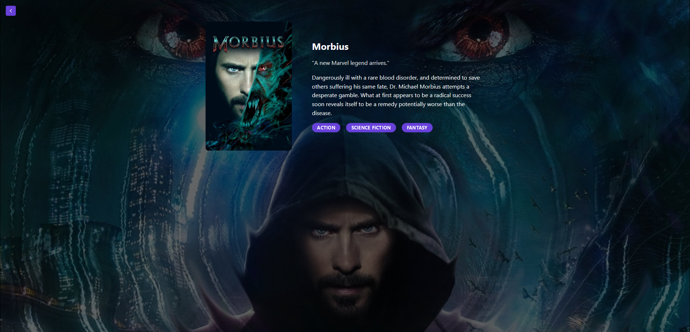

# MovFlix

MovFlix is a web app built with ReactTypeScript, Mantine UI and MovieDB API

## Screenshots

   

## Features

- See popular movies
- Animation on cards
- View Movie Summary

## Built with

- React
- Typescript
- Mantine Ui
- MovieDb API
- Framer Motion

## License

This project is licensed under the GPL-3.0 - see the license file for more details
